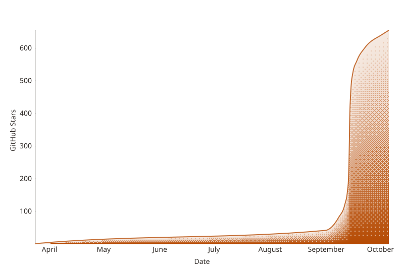

  <a href="https://openpo.st">
    <picture>
      <source media="(prefers-color-scheme: dark)" srcset="./assets/brand/lockup-dark.svg">
      
    </picture>
  </a>

<h3 align="center">An open-source alternative to Buffer, Canva, and CapCut.</h3>

  Write posts, design images and carousels, edit videos, and schedule your content in one app. 
  Self-host OpenPost or use OpenPost Hosted.

  <a href="https://github.com/getopenpost/openpost/releases">
    <picture>
      <source media="(prefers-color-scheme: dark)" srcset="./assets/badges/downloads-dark.svg">
      
    </picture>
  </a>
  <a href="https://github.com/getopenpost/openpost/releases">
    <picture>
      <source media="(prefers-color-scheme: dark)" srcset="./assets/badges/release-dark.svg">
      
    </picture>
  </a>
  <a href="https://github.com/getopenpost/openpost/stargazers">
    <picture>
      <source media="(prefers-color-scheme: dark)" srcset="./assets/badges/stars-dark.svg">
      
    </picture>
  </a>
  <a href="https://url.rgo.pt/x">
    <picture>
      <source media="(prefers-color-scheme: dark)" srcset="./assets/badges/follow-dev-dark.svg">
      
    </picture>
  </a>

  <a href="https://app.openpo.st/image-editor"><strong>Try the image editor</strong></a>
  ·
  <a href="https://app.openpo.st/video-editor"><strong>Try the video editor</strong></a>
  ·
  <a href="#self-host"><strong>Self-host</strong></a>
  ·
  <a href="https://openpo.st/docs"><strong>Docs</strong></a>

  Both editors are free to use without an account or watermark. 

  

  <a href="https://www.youtube.com/watch?v=_mZf3HzQaN8">Watch the product tour</a>
  ·
  <a href="https://openpo.st/#features">See all features</a>

<table>
  <tr>
    <td width="50%" align="center">
      <a href="https://app.openpo.st/image-editor">
        <picture>
          <source media="(prefers-color-scheme: dark)" srcset="./assets/screenshots/image-editor-dark.webp">
          
        </picture>
      </a>
       <strong>Design images and carousels</strong>
    </td>
    <td width="50%" align="center">
      <a href="https://app.openpo.st/video-editor">
        <picture>
          <source media="(prefers-color-scheme: dark)" srcset="./assets/screenshots/video-editor-dark.webp">
          
        </picture>
      </a>
       <strong>Edit and caption videos</strong>
    </td>
  </tr>
</table>

## What you can do

-  **[Connect accounts](https://openpo.st/docs/guides/accounts).** Manage your social connections in one workspace. Each provider keeps its own capabilities and publishing limits.
-  **[Compose for each platform](https://openpo.st/docs/guides/publishing).** Write posts and threads, then adjust the text and media for each account. Preview each version before publishing. Save account groups as Social Sets to reuse them.
-  **[Image editor](https://openpo.st/docs/image-editor).** Design images and multi-page carousels with layers, templates, and custom fonts. Remove backgrounds in your browser. Export individual pages or the full carousel, or attach them to your post.
-  **[Video editor](https://openpo.st/docs/video-editor).** Trim and arrange clips on a multitrack timeline. Add captions, transitions, effects, and audio. Cut footage by selecting words in its transcript.
-  **[Recorder](https://openpo.st/docs/video-editor/quick-cut-and-recorder).** Capture your screen, camera, and microphone, then bring the recording into your video edit.
-  **[Calendar and queues](https://openpo.st/docs/guides/scheduling).** Choose a publishing time or the next free slot in a queue. Plan your posts in the calendar, stagger publishing across accounts, and get reminders when your queue runs low.
-  **[Workflows](https://openpo.st/docs/automate/workflows).** Turn GitHub releases, RSS feeds, and scheduled prompts into drafts. Connect steps on a visual canvas, add AI or conditions, review posts before scheduling, and inspect each run. Use HTTP requests and JavaScript for custom data.
-  **Auto repost.** Set delays and engagement rules for native reposts on supported networks. Override the defaults for individual posts.
-  **[Media library](https://openpo.st/docs/guides/media-library).** Keep reusable images, videos, fonts, and brand assets in your workspace. Organize files with tags, collections, and favorites. Attach saved media without uploading it again.
-  **[Meme maker](https://openpo.st/docs/guides/media-library#add-media-to-a-post).** Pick a template, edit its captions, and replace its images. Save the result to your media library or attach it to a post.
-  **[Inbox and messages](https://openpo.st/docs/guides/inbox).** Read and reply to supported comments and direct messages without switching between social apps.
-  **[Analytics and repurposing](https://openpo.st/docs/guides/analytics).** Compare post results and track audience changes across your accounts. Use a previous post as the starting point for a new draft.
-  **Find people.** Find accounts to follow on Bluesky and Mastodon. Review the suggestions and choose who to follow.
-  **AI writing and ideas.** Generate ideas, compare draft directions, and adapt posts for your selected platforms. You review the result before publishing. AI writing is optional. [Self-hosted AI setup](https://openpo.st/docs/self-hosting/ai).
-  **[API, SDK, CLI, MCP, and n8n](https://openpo.st/docs/automate).** Create drafts, schedule posts, and check publishing results from your scripts, agents, or n8n workflows. Install the [TypeScript SDK](https://www.npmjs.com/package/@getopenpost/sdk) or the [CLI](https://www.npmjs.com/package/@getopenpost/cli) from npm. See the [API reference](https://openpo.st/docs/api-reference) for endpoints.
-  **[Teams and workspaces](https://openpo.st/docs/guides/workspaces).** Keep brands and clients in separate workspaces and control who can edit them. Protect your account with passkeys, two-factor authentication, and session controls.

## Get started

### OpenPost Hosted

Hosted signups are temporarily on a waitlist while we finish the remaining social platform approvals. Existing accounts can still sign in.

[Join the waitlist](https://app.openpo.st/register)

[View plans](https://openpo.st/pricing)

### Self-host

Run OpenPost with Docker Compose. The default setup uses one container with SQLite and local media storage.

<a href="https://openpo.st/docs/self-hosting/">
  <picture>
    <source media="(prefers-color-scheme: dark)" srcset="./assets/buttons/self-host-dark.svg">
    
  </picture>
</a>

[Configure integrations](https://openpo.st/docs/self-hosting/integrations) · [Backups and upgrades](https://openpo.st/docs/self-hosting/maintenance)

## Supported platforms

  
  
  
  
  
  
  
  
  
  
  
  
  
  
  
  

OpenPost has integrations for Instagram, Facebook, LinkedIn, X, TikTok, YouTube, Threads, Bluesky, Mastodon, Pixelfed, PeerTube, Lemmy, PieFed, Discord, Pinterest, and Telegram. Mastodon and Pixelfed connect per instance over OAuth; PeerTube, Lemmy, and PieFed connect with instance credentials. Discord supports incoming webhooks and a bot integration; Telegram uses a bot.

Posting formats, inbox features, and analytics vary by platform. Some integrations require provider app approval or publicly reachable media URLs.

[Connect accounts](https://openpo.st/docs/guides/accounts) · [Integration requirements](https://openpo.st/docs/self-hosting/integrations)

## Contributing

Report bugs, improve the docs, or send a pull request. For larger changes, open an issue first so we can agree on the approach.

OpenPost uses Go, SvelteKit, and Expo, with a Devenv development environment. Start with the [contributing guide](./.github/CONTRIBUTING.md) and [development setup](https://openpo.st/docs/development/setup).

<a href="https://github.com/getopenpost/openpost/issues">
  <picture>
    <source media="(prefers-color-scheme: dark)" srcset="./assets/buttons/report-bug-dark.svg">
    
  </picture>
</a>
<a href="https://discord.com/invite/u2QwukmY4W">
  <picture>
    <source media="(prefers-color-scheme: dark)" srcset="./assets/buttons/join-discord-dark.svg">
    
  </picture>
</a>

## Star history

Support OpenPost with a [GitHub star](https://github.com/getopenpost/openpost/stargazers).

<!-- star-history:start -->
<picture>
  <source media="(prefers-color-scheme: dark)" srcset="assets/star-history/star-history-dark.svg">
  
</picture>
<!-- star-history:end -->

## License and security

OpenPost uses the [AGPL-3.0-only license](./LICENSE). See the [third-party notices](./licenses/README.md) for dependency licenses and attribution.

Report vulnerabilities privately through the [security policy](./.github/SECURITY.md).
